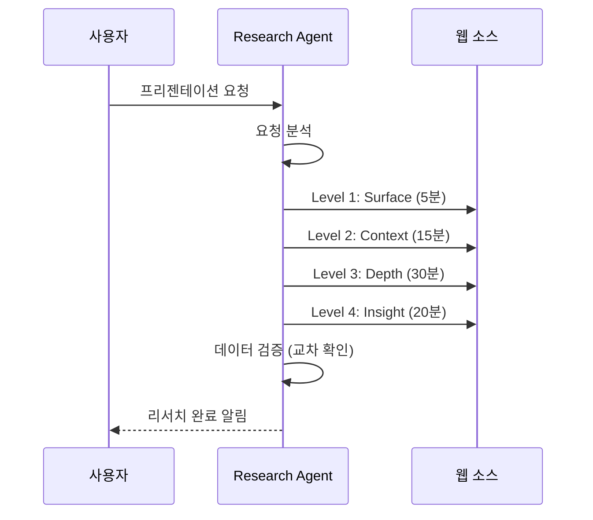
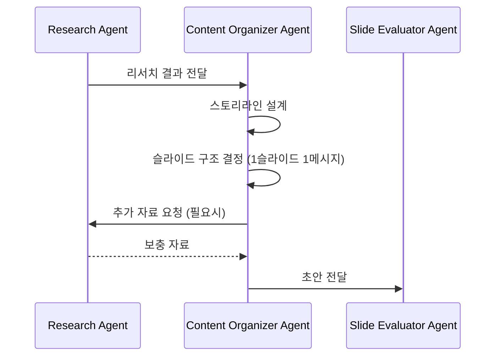
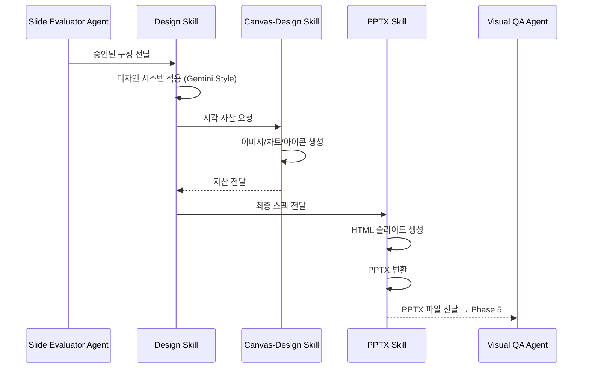
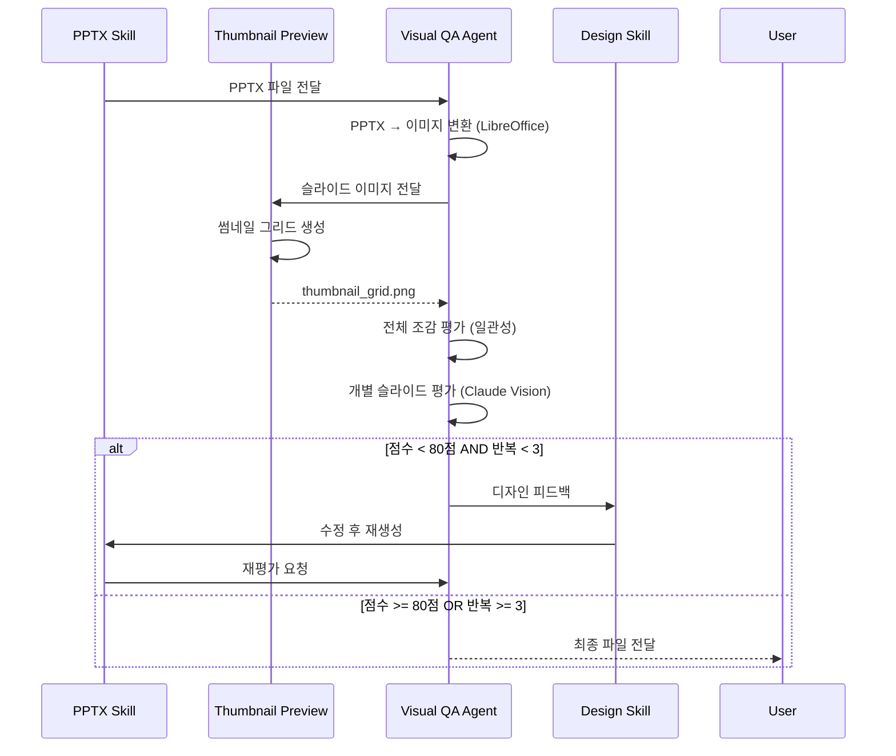

# PPT Agent Team 워크플로우 v2.0

PPT 에이전트 팀의 전체 프로세스를 정의하는 문서입니다.

---

## 개요

```
┌─────────────────────────────────────────────────────────────────────────────┐
│                     PPT Agent Team Workflow v2.0                             │
├─────────────────────────────────────────────────────────────────────────────┤
│                                                                              │
│  사용자 요청                                                                  │
│       │                                                                      │
│       ▼                                                                      │
│  ┌─────────────────┐                                                        │
│  │ Research Agent  │ ──────────────────┐                                    │
│  │ (리서치 에이전트) │                   │ 협업                               │
│  └────────┬────────┘                   │                                    │
│           │ 자료 전달                   │                                    │
│           ▼                            ▼                                    │
│  ┌─────────────────────────────────────────┐                                │
│  │       Content Organizer Agent           │                                │
│  │         (자료 정리 에이전트)              │                                │
│  └────────────────┬────────────────────────┘                                │
│                   │ 슬라이드 구성                                             │
│                   ▼                                                          │
│  ┌─────────────────────────────────────────┐                                │
│  │       Slide Evaluator Agent             │◄──────┐                        │
│  │      (슬라이드 평가 에이전트 - 논리적)    │       │ 수정 반복               │
│  └────────────────┬────────────────────────┘       │                        │
│                   │ 승인? (80점+)                   │                        │
│           ┌──────┴──────┐                         │                        │
│          NO             YES                        │                        │
│           └──────────────┼─────────────────────────┘                        │
│                          │                                                   │
│                          ▼                                                   │
│  ┌─────────────────────────────────────────────────────────────────┐        │
│  │                        Skills Layer                              │        │
│  │  ┌───────────────┐ ┌───────────────┐ ┌───────────────────────┐  │        │
│  │  │ Design Skill  │ │ Canvas-Design │ │     PPTX Skill        │  │        │
│  │  └───────────────┘ └───────────────┘ └───────────────────────┘  │        │
│  └────────────────────────────┬────────────────────────────────────┘        │
│                               │                                              │
│                               ▼                                              │
│  ┌─────────────────────────────────────────────────────────────────┐        │
│  │                  ★ Phase 5: Visual QA (NEW) ★                    │        │
│  │  ┌───────────────────┐ ┌───────────────────────────────────┐    │        │
│  │  │ Thumbnail Preview │ │       Visual QA Agent             │    │        │
│  │  │  (전체 조감 생성)  │ │    (시각적 품질 평가)              │    │        │
│  │  └───────────────────┘ └───────────────────────────────────┘    │        │
│  └────────────────────────────┬────────────────────────────────────┘        │
│                               │ 승인? (80점+)                                │
│                       ┌──────┴──────┐                                       │
│                      NO             YES                                      │
│                       │              │                                       │
│                       ▼              ▼                                       │
│              Design Skill로      ┌─────────────────────┐                    │
│              피드백 (최대 3회)   │   Final PPTX 출력    │                    │
│                                  └─────────────────────┘                    │
│                                                                              │
└─────────────────────────────────────────────────────────────────────────────┘
```

---

## v2.0 변경사항

| 항목 | v1.0 | v2.0 |
|------|------|------|
| 평가 단계 | 1단계 (논리적) | **2단계** (논리적 + 시각적) |
| Visual QA | 없음 | **Visual QA Agent 추가** |
| 썸네일 | 없음 | **Thumbnail Preview Skill 추가** |
| 피드백 루프 | Content만 | **Content + Design 이중 루프** |

---

## 단계별 상세 프로세스

### Phase 1: 요청 분석 및 리서치



**Research Agent v2.0 실행 순서:**

1. **Level 1: Surface (5분)**
   - 주제 정의 및 범위 파악
   - 주요 키워드 식별
   - 개략적 현황 파악

2. **Level 2: Context (15분)**
   - 역사적 배경
   - 시장 규모 및 성장률
   - 주요 플레이어 파악

3. **Level 3: Depth (30분)**
   - 상세 통계 및 데이터
   - 전문가 분석 및 의견
   - 사례 연구 (성공/실패)

4. **Level 4: Insight (20분)**
   - 트렌드 패턴 분석
   - 미래 예측
   - 청중 맞춤 시사점

### Phase 2: 콘텐츠 구성



**Content Organizer Agent 실행 순서:**

1. 스토리라인 설계
   - 오프닝 훅 결정
   - 핵심 메시지 정의
   - 결론 및 CTA 설계

2. 슬라이드 구성 (1슬라이드 1메시지)
   - 섹션 분리
   - 각 슬라이드 목적 정의
   - 6x6 규칙 적용

3. 콘텐츠 배치
   - 텍스트 구조화
   - 데이터 시각화 계획
   - 발표자 노트 작성

### Phase 3: 논리적 평가


**Slide Evaluator Agent 평가 기준 (논리적):**

| 항목 | 배점 | 평가 내용 |
|------|------|----------|
| 구조적 완성도 | 25점 | 도입-본론-결론, 논리적 흐름 |
| 메시지 전달력 | 25점 | 핵심 메시지 명확성 |
| 시각적 일관성 | 25점 | 구성 계획의 일관성 |
| 설득력 | 25점 | 근거의 신뢰성, 스토리텔링 |
| **총점** | **100점** | **80점 이상 통과** |

### Phase 4: 디자인 및 생성



**Skills 실행 순서:**

1. **Design Skill v2.0**
   - Gradient-First Design 적용
   - Circular Form Language (둥근 모서리)
   - Warm Spatial Quality (여백, 그림자)
   - 색상 팔레트 선택

2. **Canvas-Design Skill**
   - 커스텀 차트 생성
   - 인포그래픽 제작
   - 아이콘/그래픽 생성

3. **PPTX Skill**
   - HTML 슬라이드 코딩
   - PptxGenJS로 PPTX 생성

### Phase 5: 시각적 품질 검증 (NEW)



**Visual QA Agent 평가 기준 (시각적):**

| 항목 | 배점 | 평가 내용 |
|------|------|----------|
| 시각적 계층 | 25점 | 제목/본문 구분, 강조 요소 |
| 색상 조화 | 20점 | 팔레트 일관성, 대비 |
| 레이아웃 균형 | 20점 | 여백, 정렬, 균형 |
| 타이포그래피 | 20점 | 폰트 크기, 가독성 |
| 전문성/완성도 | 15점 | 디테일, 완성도 |
| **총점** | **100점** | **80점 이상 통과** |

**Thumbnail Preview Skill:**

- 전체 슬라이드를 그리드로 조합
- 일관성, 시각적 리듬 확인용
- 문제 슬라이드 강조 표시

---

## 이중 피드백 루프 시스템

### 논리적 피드백 루프 (Phase 3)

```
Slide Evaluator (논리 평가)
         ↓ 80점 미만
Content Organizer (구성 수정)
         ↓
Slide Evaluator (재평가)
         ↓ 반복 (무제한, 사용자 개입 가능)
```

### 시각적 피드백 루프 (Phase 5)

```
Visual QA Agent (시각 평가)
         ↓ 80점 미만
Design Skill (디자인 수정)
         ↓
PPTX Skill (재생성)
         ↓
Visual QA Agent (재평가)
         ↓ 반복 (최대 3회)
```

---

## 데이터 흐름

### Research Agent → Content Organizer Agent

```json
{
  "topic": "AI Trends 2026",
  "research_date": "2026-02-03",
  "confidence_score": 0.85,
  "executive_summary": "...",
  "market_data": {
    "current_size": {"value": 294, "unit": "billion USD", "year": 2025},
    "projected_size": {"value": 375, "unit": "billion USD", "year": 2026}
  },
  "trends": [...],
  "statistics": [...],
  "case_studies": [...],
  "references": [...]
}
```

### Slide Evaluator Agent → Skills

```json
{
  "approved": true,
  "score": 85,
  "design_brief": {
    "tone": "modern-professional",
    "palette": "Modern Clarity",
    "audience": "C-level executives"
  },
  "slides": [...],
  "visual_requirements": [...]
}
```

### Visual QA Agent → Design Skill (피드백)

```json
{
  "qa_round": 1,
  "overall_score": 72,
  "passed": false,
  "design_feedback": {
    "global": {
      "color_palette": {"issue": "대비 부족", "adjustment": "..."}
    },
    "per_slide": {
      "3": {"layout": "padding 증가 필요"},
      "7": {"visual_hierarchy": "핵심 숫자 강조 부족"}
    }
  },
  "priority_order": [3, 7, 2, 5]
}
```

---

## 오류 처리

### 리서치 실패

```
원인: 웹 검색 결과 부족, 신뢰할 수 없는 출처
처리:
  1. 대체 키워드로 재검색
  2. 사용자에게 추가 정보 요청
  3. 일반적인 정보로 대체 (사용자 승인 후)
```

### 논리적 평가 실패 (3회 이상)

```
원인: 평가 기준 미달 반복
처리:
  1. 사용자에게 현재 상태 보고
  2. 요구사항 조정 제안
  3. 수동 승인 요청
```

### 시각적 평가 실패 (3회)

```
원인: 디자인 품질 기준 미달 반복
처리:
  1. 현재 최선 버전으로 출력
  2. 문제점 보고서 제공
  3. 수동 디자인 수정 권고
```

### PPTX/이미지 변환 실패

```
원인: 파일 손상, LibreOffice 오류
처리:
  1. 검증 스크립트 실행
  2. 문제 요소 제거 후 재생성
  3. 대안 형식 제안 (PDF)
```

---

## 성능 최적화

### 병렬 처리 가능 작업

```
Research Agent
├── 통계 검색 ──┬── 사례 검색 ──┬── 이미지 검색
└───────────────┴───────────────┴──────────────
                    ▼
              결과 병합

Canvas-Design Skill
├── 차트 1 ──┬── 차트 2 ──┬── 아이콘 세트
└────────────┴────────────┴────────────────
                    ▼
              자산 패키지

Visual QA Agent
├── 슬라이드 1-5 평가 ──┬── 슬라이드 6-10 평가
└───────────────────────┴─────────────────────
                    ▼
              종합 평가
```

### 캐싱 전략

```yaml
cache:
  research_results:
    ttl: 24h
    key: topic + date

  design_assets:
    ttl: 7d
    key: style_hash + asset_type

  slide_images:
    ttl: 1h
    key: pptx_hash

  templates:
    ttl: 30d
    key: template_name + version
```

---

## 최종 산출물

### 기본 출력

```
output/
├── presentation.pptx        # 최종 프리젠테이션
├── slides/
│   ├── slide-1.png          # 슬라이드 이미지
│   ├── slide-2.png
│   └── ...
├── thumbnail_grid.png       # 전체 조감 이미지
├── assets/                  # 사용된 시각 자료
├── research_report.md       # 리서치 보고서
├── visual_qa_report.md      # 시각적 평가 보고서
├── speaker_notes.md         # 발표자 노트
└── sources.md               # 참고 자료
```

### 메타데이터

```json
{
  "version": "2.0",
  "created_at": "2026-02-03T12:00:00Z",
  "iterations": {
    "content_revisions": 1,
    "design_revisions": 2
  },
  "scores": {
    "slide_evaluator": 85,
    "visual_qa": 82
  },
  "processing_time": {
    "research": "5m",
    "content": "2m",
    "design": "3m",
    "visual_qa": "2m"
  }
}
```

---

## 사용 예시

### 기본 사용

```
사용자: "AI 트렌드에 대한 10분 프리젠테이션을 만들어줘.
       청중은 기업 임원들이고, 투자 결정에 도움이 될 내용으로."

Phase 1: Research Agent → AI 트렌드 심층 리서치
Phase 2: Content Organizer → 임원 대상 10슬라이드 구성
Phase 3: Slide Evaluator → 논리적 평가 (85점 통과)
Phase 4: Design + PPTX → Modern Clarity 스타일 적용
Phase 5: Visual QA → 시각적 평가 (78점)
         → Design 피드백 → 재생성 (82점 통과)
→ 최종 출력
```

### 시각적 피드백 루프 예시

```
Visual QA 1차 평가: 72점 (불합격)

피드백:
- 슬라이드 3: 텍스트 대비 부족 (Critical)
- 슬라이드 7: 레이아웃 불균형 (Major)
- 전체: 아이콘 스타일 불일치 (Minor)

Design Skill 수정:
- 텍스트 색상 조정 (#64748B → #0F172A)
- 슬라이드 7 패딩 20% 증가
- 아이콘 스타일 통일 (outline)

Visual QA 2차 평가: 81점 (통과)
→ 최종 파일 출력
```
