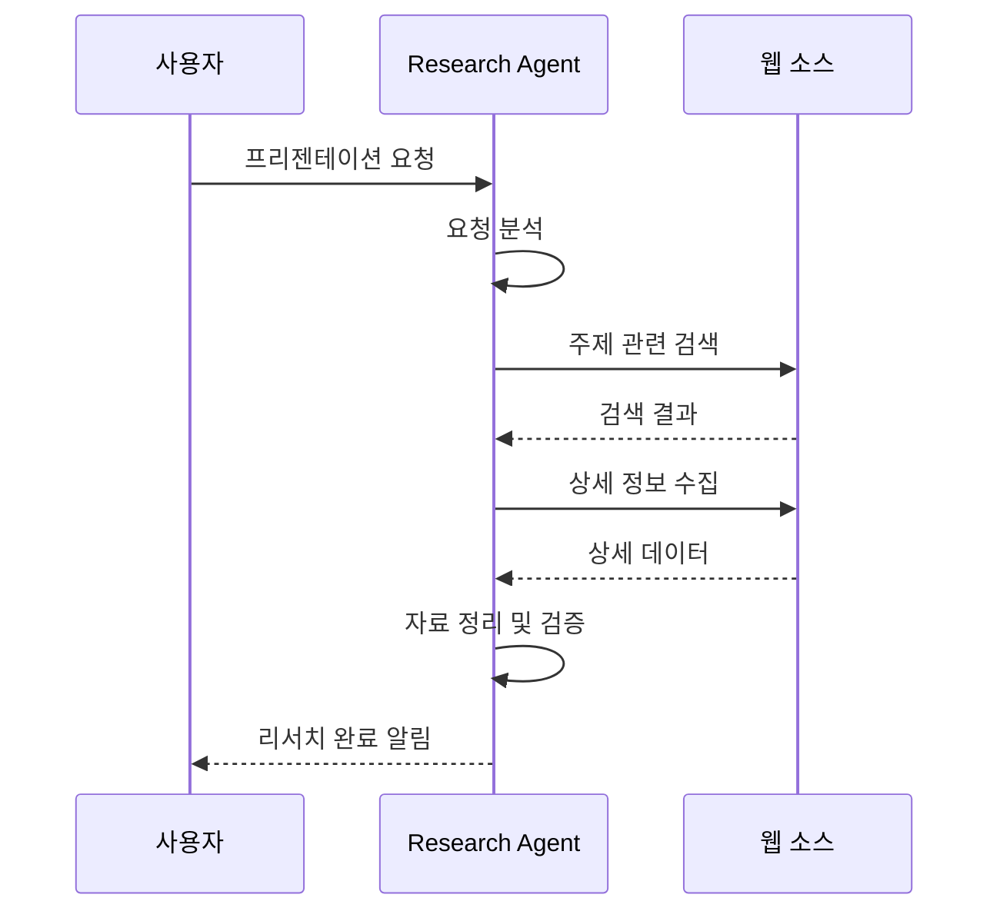
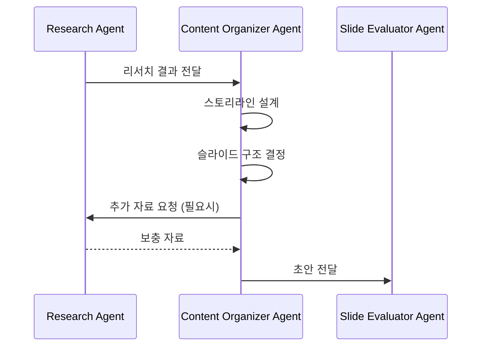
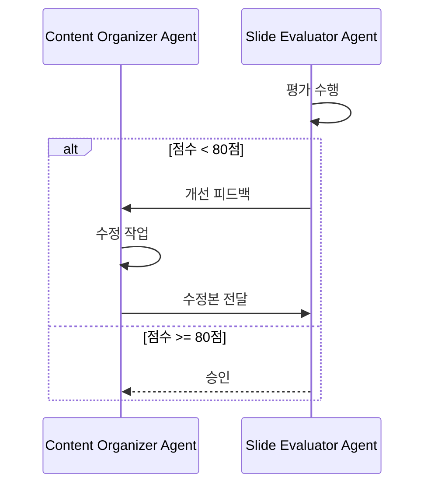
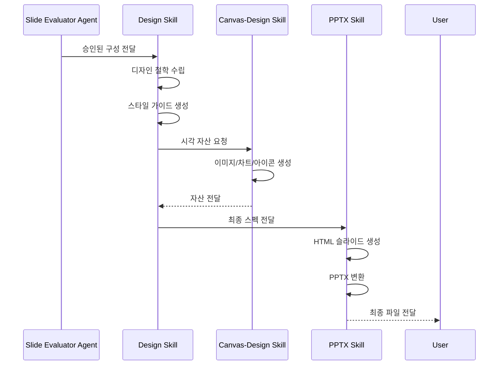

# PPT Agent Team 워크플로우

PPT 에이전트 팀의 전체 프로세스를 정의하는 문서입니다.

## 개요

```
┌─────────────────────────────────────────────────────────────────────────────┐
│                         PPT Agent Team Workflow                              │
├─────────────────────────────────────────────────────────────────────────────┤
│                                                                              │
│  사용자 요청                                                                  │
│       │                                                                      │
│       ▼                                                                      │
│  ┌─────────────────┐                                                        │
│  │ Research Agent  │ ──────────────────┐                                    │
│  │  (리서치 에이전트) │                   │                                    │
│  └────────┬────────┘                   │                                    │
│           │                            │ 협업                                │
│           │ 자료 전달                   │                                    │
│           ▼                            ▼                                    │
│  ┌─────────────────────────────────────────┐                                │
│  │       Content Organizer Agent           │                                │
│  │         (자료 정리 에이전트)              │                                │
│  └────────────────┬────────────────────────┘                                │
│                   │                                                          │
│                   │ 슬라이드 구성                                             │
│                   ▼                                                          │
│  ┌─────────────────────────────────────────┐                                │
│  │       Slide Evaluator Agent             │◄──────┐                        │
│  │         (슬라이드 평가 에이전트)          │       │ 수정 반복               │
│  └────────────────┬────────────────────────┘       │                        │
│                   │                                │                        │
│                   │ 승인?                          │                        │
│           ┌──────┴──────┐                         │                        │
│          NO             YES                        │                        │
│           │              │                         │                        │
│           └──────────────┼─────────────────────────┘                        │
│                          │                                                   │
│                          ▼                                                   │
│  ┌─────────────────────────────────────────────────────────────────┐        │
│  │                        Skills Layer                              │        │
│  │  ┌───────────────┐ ┌───────────────┐ ┌───────────────────────┐  │        │
│  │  │ Design Skill  │ │  PPTX Skill   │ │ Canvas-Design Skill   │  │        │
│  │  │ (디자인 스킬)  │ │ (PPTX 스킬)   │ │ (캔버스 디자인 스킬)   │  │        │
│  │  └───────────────┘ └───────────────┘ └───────────────────────┘  │        │
│  └────────────────────────────┬────────────────────────────────────┘        │
│                               │                                              │
│                               ▼                                              │
│                    ┌─────────────────────┐                                  │
│                    │   Final PPTX 출력    │                                  │
│                    └─────────────────────┘                                  │
│                                                                              │
└─────────────────────────────────────────────────────────────────────────────┘
```

## 단계별 상세 프로세스

### Phase 1: 요청 분석 및 리서치



**Research Agent 실행 순서:**

1. 사용자 요청 파싱
   - 프리젠테이션 주제 추출
   - 대상 청중 파악
   - 목적 및 범위 정의

2. 웹 리서치 수행
   - 주제별 키워드 검색
   - 관련 통계 및 데이터 수집
   - 신뢰할 수 있는 출처 검증

3. 자료 구조화
   - 카테고리별 분류
   - 중요도 평가
   - 출처 정리

### Phase 2: 콘텐츠 구성



**Content Organizer Agent 실행 순서:**

1. 스토리라인 설계
   - 오프닝 훅 결정
   - 핵심 메시지 정의
   - 결론 및 CTA 설계

2. 슬라이드 구성
   - 섹션 분리
   - 각 슬라이드 목적 정의
   - 시각 자료 계획

3. 콘텐츠 배치
   - 텍스트 구조화
   - 데이터 시각화 계획
   - 발표자 노트 작성

### Phase 3: 평가 및 개선



**Slide Evaluator Agent 평가 기준:**

| 항목 | 배점 | 통과 기준 |
|------|------|----------|
| 구조적 완성도 | 25점 | 20점 이상 |
| 메시지 전달력 | 25점 | 20점 이상 |
| 시각적 일관성 | 25점 | 20점 이상 |
| 설득력 | 25점 | 20점 이상 |
| **총점** | **100점** | **80점 이상** |

### Phase 4: 디자인 및 생성



**Skills 실행 순서:**

1. **Design Skill**
   - 디자인 방향 결정
   - 색상 팔레트 선택
   - 폰트 페어링 선택
   - 레이아웃 패턴 정의

2. **Canvas-Design Skill**
   - 커스텀 차트 생성
   - 인포그래픽 제작
   - 아이콘/그래픽 생성
   - 배경 이미지 생성

3. **PPTX Skill**
   - HTML 슬라이드 코딩
   - 브라우저 렌더링
   - PPTX 파일 생성
   - 품질 검증

## 데이터 흐름

### 에이전트 간 데이터 전달 형식

#### Research Agent → Content Organizer Agent

```json
{
  "research_report": {
    "topic": "AI 트렌드 2024",
    "summary": "핵심 요약...",
    "sections": [
      {
        "title": "시장 현황",
        "content": "...",
        "data": [
          {"metric": "시장 규모", "value": "$190B", "source": "..."}
        ],
        "images": [],
        "reliability": "high"
      }
    ],
    "statistics": [...],
    "references": [...]
  }
}
```

#### Content Organizer Agent → Slide Evaluator Agent

```json
{
  "presentation": {
    "title": "프리젠테이션 제목",
    "slides": [
      {
        "number": 1,
        "type": "title",
        "title": "AI의 미래",
        "key_message": "...",
        "content": {...},
        "speaker_notes": "..."
      }
    ],
    "storyline": {...}
  }
}
```

#### Slide Evaluator Agent → Skills

```json
{
  "approved": true,
  "score": 85,
  "design_brief": {
    "tone": "professional-bold",
    "audience": "C-level executives",
    "duration": "15 minutes"
  },
  "slides": [...],
  "visual_requirements": [
    {"slide": 5, "type": "chart", "data": {...}},
    {"slide": 8, "type": "infographic", "spec": {...}}
  ]
}
```

## 오류 처리

### 리서치 실패

```
원인: 웹 검색 결과 부족, 신뢰할 수 없는 출처
처리:
  1. 대체 키워드로 재검색
  2. 사용자에게 추가 정보 요청
  3. 일반적인 정보로 대체 (사용자 승인 후)
```

### 평가 실패 (3회 이상)

```
원인: 평가 기준 미달 반복
처리:
  1. 사용자에게 현재 상태 보고
  2. 요구사항 조정 제안
  3. 수동 승인 요청
```

### PPTX 생성 실패

```
원인: 파일 손상, 이미지 누락
처리:
  1. 검증 스크립트 실행
  2. 문제 요소 제거 후 재생성
  3. 대안 형식 제안 (PDF)
```

## 성능 최적화

### 병렬 처리

```
┌──────────────────────────────────────────────────┐
│              병렬 실행 가능 작업                   │
├──────────────────────────────────────────────────┤
│                                                  │
│  Research Agent                                  │
│  ├── 통계 검색 ──┬── 사례 검색 ──┬── 이미지 검색 │
│  │               │               │              │
│  └───────────────┴───────────────┴──────────────│
│                   ▼                              │
│           결과 병합                               │
│                                                  │
├──────────────────────────────────────────────────┤
│                                                  │
│  Canvas-Design Skill                             │
│  ├── 차트 1 ──┬── 차트 2 ──┬── 아이콘 세트       │
│  │            │            │                    │
│  └────────────┴────────────┴────────────────────│
│                   ▼                              │
│           자산 패키지                             │
│                                                  │
└──────────────────────────────────────────────────┘
```

### 캐싱 전략

```yaml
cache:
  research_results:
    ttl: 24h
    key: topic + date

  design_assets:
    ttl: 7d
    key: style_hash + asset_type

  templates:
    ttl: 30d
    key: template_name + version
```

## 사용 예시

### 기본 사용

```
사용자: "AI 트렌드에 대한 10분 프리젠테이션을 만들어줘.
       청중은 기업 임원들이고, 투자 결정에 도움이 될 내용으로."

→ Research Agent: AI 트렌드 관련 최신 자료 수집
→ Content Organizer: 임원 대상 10분 분량 구성 (10-12 슬라이드)
→ Slide Evaluator: 비즈니스 맥락 적합성 평가
→ Design Skill: 럭셔리 모던 스타일 적용
→ Canvas-Design: 시장 차트, 성장 그래프 생성
→ PPTX Skill: 최종 프리젠테이션 생성
```

### 반복 수정

```
평가 결과: 72점 (통과 기준 미달)

피드백:
- 슬라이드 5-7: 데이터 시각화 부족
- 결론부: CTA 불명확

Content Organizer 수정:
- 슬라이드 5-7: 차트 추가 계획
- 슬라이드 12: CTA 문구 강화

재평가 결과: 88점 (통과)
→ 디자인 및 생성 단계로 진행
```

## 최종 산출물

1. **presentation.pptx**: 최종 PowerPoint 파일
2. **assets/**: 사용된 모든 시각 자료
3. **speaker_notes.md**: 발표자 노트 전체본
4. **design_guide.md**: 디자인 가이드 (수정 시 참고용)
5. **sources.md**: 참고 자료 및 출처 목록
